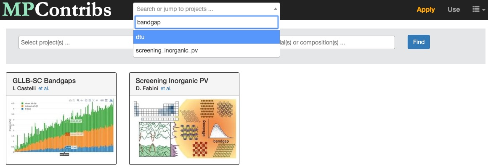
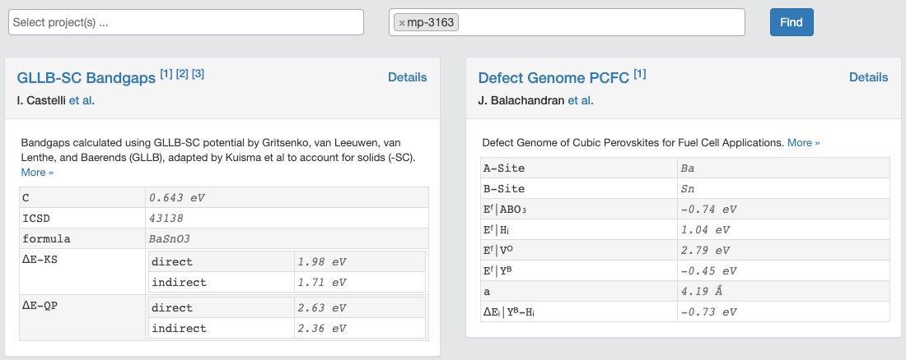
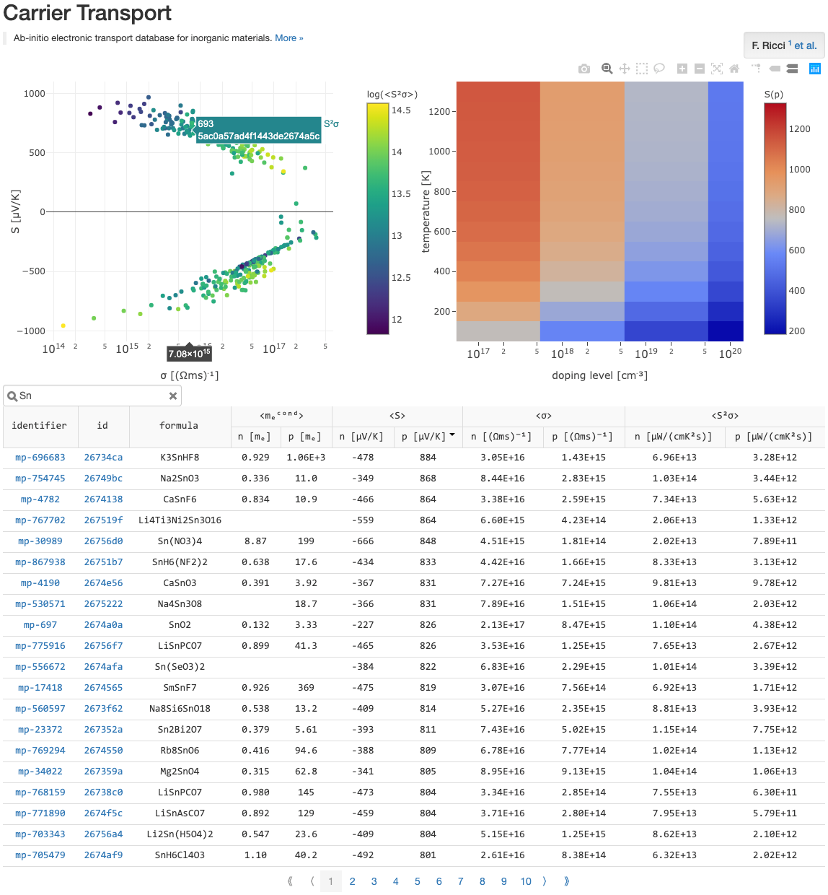
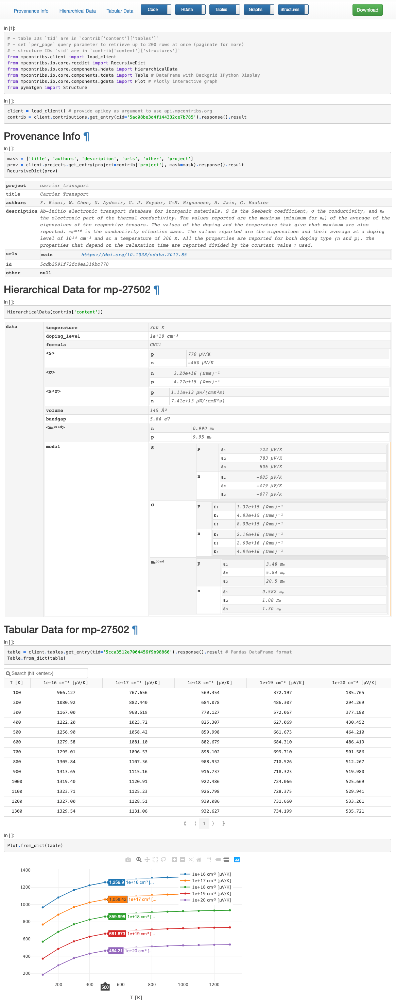

# Community Contributions to Materials Project

The *MPContribs* platform enables the materials science community to contribute
experimental and theoretical materials data to [Materials
Project](https://materialsproject.org) (MP) and use MP's infrastructure to expose their
research results to the public. Contributions to MP are collectively maintained as
annotations to existing MP materials. It subsequently disseminates them as preview cards
on MP's materials details pages, in form of domain-specific interactive landing pages on
its [portal](/portal), and programmatically through its [API](/api).

## Explore Data

The [Portal](https://portal.mpcontribs.org) contains an entry for every contributed
dataset which links to the respective landing pages. Each entry also includes the project
title, its authors, and a small preview icon. Each project/dataset can contain many
contributions for an MP material or composition. A dropdown menu is provided for quick
access of project landing pages and includes a search box to filter project descriptions
by keywords.

Search and preview of contributions across all materials and projects. When projects
and/or material identifiers are requested, a preview card is generated and displayed for
a couple of representative contributions. The title of the card links to the project's
[landing page](#dataset-landing-pages), and the *Details* button opens the corresponding
[detail page](#contribution-detail-pages). Authors and description are expandable, and
references linked as footnotes. Each contribution card also contains its simple
hierarchical data.

### Dataset Landing Pages

Each project/dataset has a *landing page* with a unique URL on the MPContribs Portal. The
page serves as entry point for contributors to share with their community and refer to an
overview of their dataset in journals, for instance. In addition to a short title,
description, authors and references, a landing page also contains a generic overview table
listing all the project's contributions to MP materials or compositions. This default
table provides a few important functionalities out of the box:

* **Search Box**: Filter the list of contributions by searching for specific sub-strings
    in the MP material or composition identifiers as well as the first non-id column
    (usually `formula`).
* **Grouped Headers**: Nested fields in contributions' hierarchical data[^1] automatically
    appear grouped in the table header. Units are also pulled into header next to the
    column name.
* **Column Sort**: By default, the table is sorted by contribution insertion order
    (`natural`). Any other column can be used for the table sort by clicking on the column
    name. Repeated clicks cycle through ascending, descending and natural order.
* **Pagination**: Contributions are paginated in batches of 20. The pages can be iterated
    with the navigation at the bottom of the table.
* **MP Details Pages**: The first column in the overview table contains the MP material
    ID or the composition as identifier to link a contribution to the according entries in
    the core MP database.
* **Contribution Details Pages**: The second column links to the [Details
    Page](#contribution-detail-pages) for a contribution containing a rendered version of
    the full database entry.
* **CIF Files**: If structures are part of a contribution, a `CIF` column is added to the
    overview table containing a URL to download the structure in
    [CIF](https://en.wikipedia.org/wiki/Crystallographic_Information_File) format.
* **Column Manager**: Table columns to be shown or hidden can be selected via simple
    dropdown menu.

An optional but powerful component of landing pages are interactive overview graphs. These
graphs are under full control and responsibility of the domain expert contributing the
dataset. In most cases, they represent an interactive version of the accompanying journal
publication which allows interested readers to dig deeper into a dataset. We use the
graphing library [Plotly](https://plot.ly/javascript/) which supports additional filter
mechanisms and click events to link data points to their according contribution details
pages.

### Contribution Detail Pages

Each contribution in a dataset is assigned a unique identifier (see MongoDB
[ObjectId](https://docs.mongodb.com/manual/reference/method/ObjectId/)) which can be used
to access its *Contribution Details Page* rendering an interactive version of its full
content. For instance, the above screenshot is a truncated version of the detail page at

https://portal.mpcontribs.org/explorer/5ac08be3d4f144332ce7b785

A contribution consists of three (optional) components: free-form hierarchical data,
tabular data, and crystal structures. The detail page is a static version of a fully
functional [Jupyter](https://jupyter.org/) notebook using the MPContribs [API
Client](https://pypi.org/project/mpcontribs-client/) and
[I/O](https://pypi.org/project/mpcontribs-io/) python libraries. It contains code showing
how to interact with a contribution programmatically along with the resulting output. The
navigation bar at the top provides links to jump to a respective component, toggle buttons
to show/hide components, and a download button to retrieve the contribution in JSON
format.

## Contribute & Retrieve Data

The [MPContribs API](https://api.mpcontribs.org) provides programmatic access to
experimental and theoretical data contributed by the MP community. Project information is
retrievable through the [`projects`](#projects) resource, and the corresponding
contributed data through the [`contributions`](#contributions) resource. Each project can
contain many contributions for an MP material or composition. Each contribution in turn
consists of three (optional) components: free-form hierarchical data, tabular data, and
crystal structures. There are separate dedicated resource endpoints for
[`tables`](#tables) and [`structures`](#structures) both of which are referenced in the
contributions.

Visit the [usage page](https://portal.mpcontribs.org/use) on the portal to get started
with the MPContribs API. It shows notebooks with example code that can be copied to
execute on your own machine or launched in the browser on our own compute resources.
Check out the [API Docs](https://api.mpcontribs.org) for more details about the available
resources shown below. The docs can also be used to try out the API in the browser.

### Projects

| field       | description                                                |
| ----------- | ---------------------------------------------------------- |
| project     | short URL-compatible name                                  |
| title       | short title to fit on contribution cards                   |
| authors     | comma-separated list of authors                            |
| description | paragraph to describe project/dataset                      |
| urls        | list of references in form of URLs                         |
| other       | optional free-form content applicable to all contributions |

### Contributions

| field       | description                                                |
| ----------- | ---------------------------------------------------------- |
| id                 | unique contribution ID                              |
| project            | short URL-compatible name                           |
| identifier         | material ID (mp-id) or composition                  |
| collaborators      | list of collaborators/contributors                  |
| content.data       | hierarchical free-form data                         |
| content.tables     | list of references to [tables](#tables)             |
| content.structures | list of references to [structures](#structures)     |

### Tables

| field      | description                                                |
| ---------- | ---------------------------------------------------------- |
| id         | unique table ID                                            |
| project    | short URL-compatible name                                  |
| identifier | material ID (mp-id) or composition                         |
| name       | table name (unique together with project & identifier)     |
| cid        | contribution ID to which this table belongs                |
| columns    | table header / column names                                |
| data       | table rows (see [Pandas Docs](https://pandas.pydata.org/pandas-docs/version/0.23/generated/pandas.DataFrame.to_dict.html)) |

### Structures

| field      | description                                                |
| ---------- | ---------------------------------------------------------- |
| id         | unique structure ID                                        |
| project    | short URL-compatible name                                  |
| identifier | material ID (mp-id) or composition                         |
| name       | structure name (unique together with project & identifier) |
| cid        | contribution ID to which this structure belongs            |
| lattice    | pymatgen [lattice](https://github.com/materialsproject/pymatgen/blob/master/pymatgen/core/lattice.py) |
| sites      | list of pymatgen [sites](https://github.com/materialsproject/pymatgen/blob/master/pymatgen/core/sites.py) |
