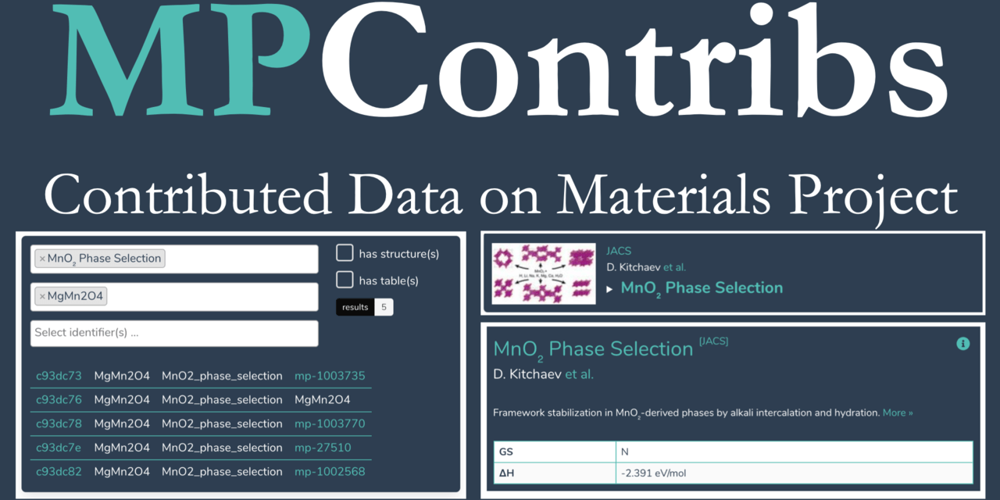

# Community Contributions to Materials Project

*MPContribs* enables materials researchers to contribute experimental and theoretical
materials data to [Materials Project](https://materialsproject.org) (MP).  Data on
*MPContribs* is collectively maintained as annotations to existing MP materials and
automatically exposed to over 100,000 MP users.  *MPContribs* disseminates contributions
as preview cards on MP's [materials details
pages](https://materialsproject.org/materials/mp-22987/#user-contribs), in form of
domain-specific interactive landing pages on its [portal](https://portal.mpcontribs.org),
and programmatically through its [API](https://api.mpcontribs.org).

MPContribs deployments dedicated to datasets for
[Machine Learning](https://ml.materialsproject.org) and from
[DOE Light Sources](https://lightsources.materialsproject.org)
are currently being built up.
