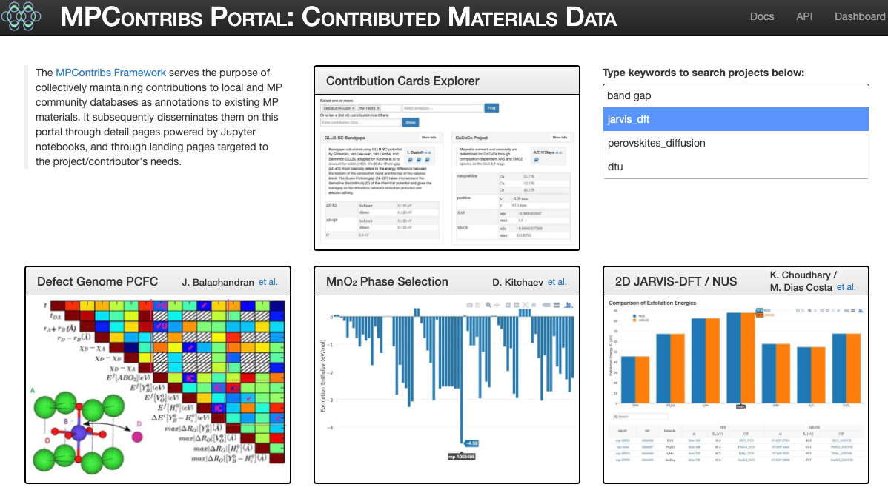

# Explore contributed data sets

The MPContribs [Portal](https://portal.mpcontribs.org) contains an entry for every
contributed dataset which links to the respective landing pages. Each entry also includes
the project title, its authors, and a small preview icon. Project description and author
list can be search for keywords to reduce the list of displayed entries. Browsing
contributions across datasets/projects as well as materials can be done with the
*Contribution Cards Explorer*. The key to authenticate against the MPContribs [API](/api)
is shown on the user's dashboard.

## Contribution Cards Explorer

The [Cards Explorer](https://portal.mpcontribs.org/explorer/) allows search and preview of
contributions across all materials and projects. When projects and/or material identifiers
are requested, a preview card is generated and displayed for a couple of representative
contributions. The title of the card links to the project's landing page, and the
*Details* button opens the corresponding [detail page](/portal/detail_pages). Authors and
description are expandable, and references linked as footnotes. Each contribution card
also shows a subset of its nested/hierarchical data.

The [`card`](/api/#card) endpoint in the
[contributions](https://api.mpcontribs.org/#/contributions) resource of the API provides
embeddable code snippets. These are also used to render the cards in the materials details
pages on MP, for instance.

## Dataset Landing Pages

!!! warning
    Under construction.

## Contribution Detail Pages

!!! warning
    Coming soon.

