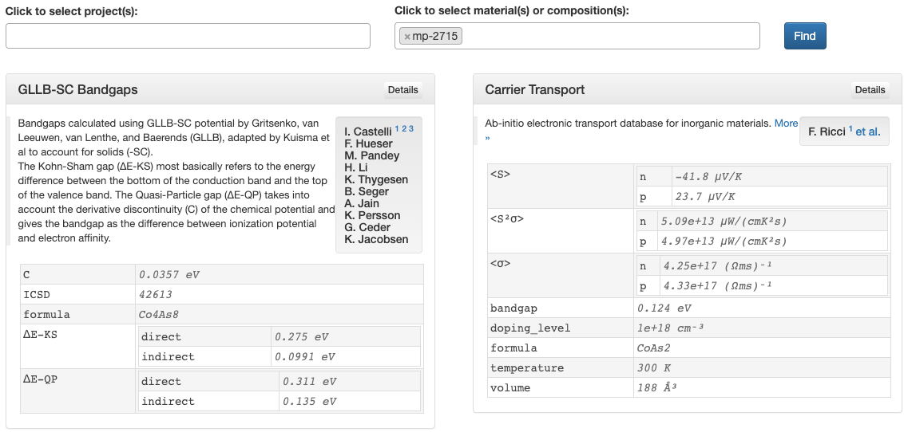

# Contribution Cards Explorer

The [Cards Explorer](https://portal.mpcontribs.org/explorer/) allows search and preview of
contributions across all materials and projects. When projects and/or material identifiers
are requested, a preview card is generated and displayed for a couple of representative
contributions. The title of the card links to the project's landing page, and the
*Details* button opens the corresponding [detail page](/portal/detail_pages). Authors and
description are expandable, and references linked as footnotes. Each contribution card
also shows a subset of its nested/hierarchical data.

The [`card`](/api/#card) endpoint in the
[contributions](https://api.mpcontribs.org/#/contributions) resource of the API provides
embeddable code snippets. These are also used to render the cards in the materials details
pages on MP, for instance.

# Contribution Detail Pages

!!! warning
    Coming soon.

# Default Landing Page Layout

!!! warning
    Coming soon.
